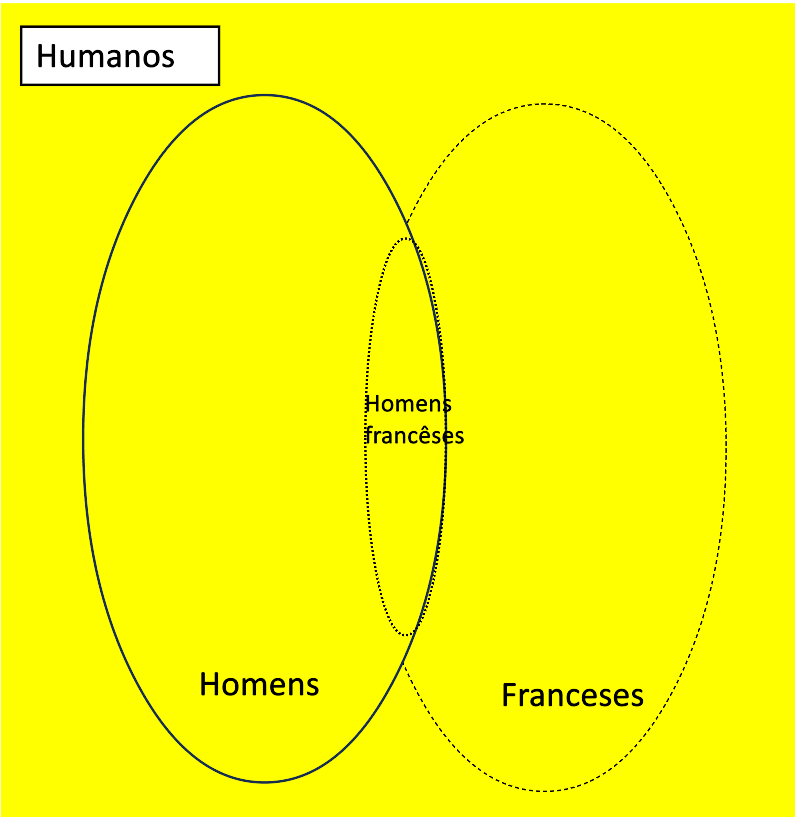

3.2. Represente usando diagrama de Venn e determine a validade dos seguintes argumentos
(especifique quem são as premissas e quem é a conclusão no silogismo categórico):

a) Todos os consumidores de barras cereal estão acima do peso. Alguns praticantes de
musculação consomem barras de cereal. Portanto, alguns praticantes de musculação estão
acima do peso.

Pa: Todos os consumidores de barras cereal estão acima do peso.
Pb: Alguns praticantes de musculação consomem barras de cereal.
Conclusão: Portanto, alguns praticantes de musculação estão acima do peso

b) Nenhum estudante aprovado em estrutura de dados fica desempregado. Existem pessoas
felizes que foram aprovadas em estruturas de dados. Dessa forma, existem pessoas felizes
empregadas.

Pa: Nenhum estudante aprovado em ED fica desempregado.
Pb: Existem pessoas felizes que foram aprovadas em ED
Conclusão: Eistem pessoas felizes empregadas.

c) Todos os homens são humanos. Alguns humanos são franceses. Portanto, alguns homens
são franceses. 

Pa: Todos os homens são humanos
Pb: Alguns humanos são franceses
Conclusão: Alguns homens são franceses
